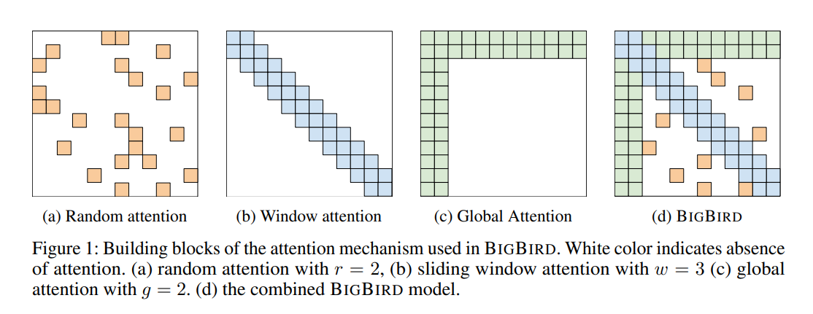

[paper]: https://arxiv.org/abs/2007.14062
[github]: https://github.com/google-research/bigbird
[gl_bucket]: https://console.cloud.google.com/storage/browser/bigbird-transformer
[hf_base]: https://huggingface.co/google/bigbird-roberta-base

# BigBird

Model introduced by [Zaheer et al. in 2020][paper]. Code, examples, links to
pre-trained weights are available on [Github][github].

## Summary

BigBird's article is definitely more involved. It touches on several key points:

1. Why transformers for longer sequences are necessary?
2. Is sparse attention enough (theoretically)?
3. Limitations of sparse attention.
4. Different implementation of sparse attention in GPUs than Longformer.
5. Different type of sparse attention than Longformer.

When I need some of these topics, let's elaborate on them below.

## Attention

BigBird uses three types of attention:

- local windowed attention: each token gets information from his $k$ surrounding
  tokens,
- random attention: for each token receives information from a randomly chosen
  other token -- this is the main **difference from Longformer**
- global attention: some selected tokens get information from all other tokens

There are two types of global attention that then create two BigBird
models:

- BigBird-ITC: global tokens are chosen among the existing input tokens,
- BigBird-ETC: other dummy tokens are served on input, which become the global
  tokens

BigBird-ETC improves performance as attention can store additional information
in the dummy tokens.

Resulting BigBird's attention is composed of all three attention types and both
types of global attention -- there are new dummy tokens (such as CLS) with
global attention as well as there are original tokens that receive global
attention.

### Attention implementation

BigBird implements attention with blocks. To avoid the costly gather operation
BigBird's attentions splits key, query and value matricies to blocks and which
then concatenates/copies/reshapes such that the whole attention can be computed
with a single batched tensor multiplication. The result is both time and space
complexity is $O(n(g + w + r)bd)$, where

- $n$ is sequence length
- $g$, $w$ and $r$ is number of global tokens, window size and number of random
  tokens per query
- $b$ is block size
- $d$ is hidden dimension.

## Theoretical results

The authors reframe attention as a graph and thus turn to existing graph theory
to back up their decisions regarding the attention design. There are other
articles I would need to read to understand such concepts of Turing complete
attention and Universal Approximators of sequence-to-sequence functions.

The results are that the sparse attention is powerful enough, but to match the
power of full attention you'd need more layers -- i.e. there is no free lunch.

## Transfer learning

It seems that BigBird can directly use Bert/RoBERTa weight, though the provided
weights (both on [Google Bucket][gl_bucket] and on [Hugging face][hf_base]) are
already fine-tuned for BigBird, with RoBERTa weights serving as warm start
initialization.
